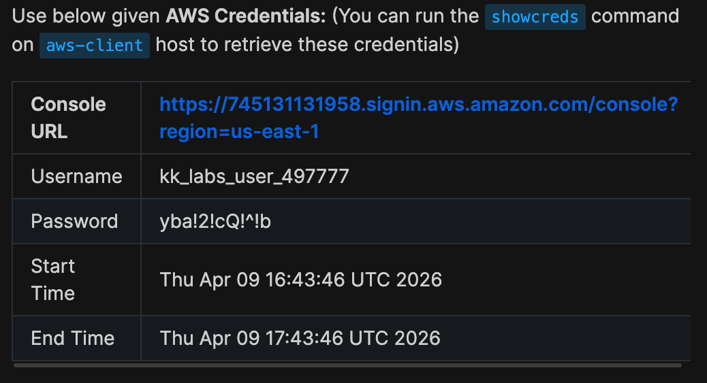

# Day 1: Create Key Pair

## Introduction

The Nautilus DevOps team is strategizing the migration of a portion of their infrastructure to the AWS cloud. Recognizing the scale of this undertaking, they have opted to approach the migration in incremental steps rather than as a single massive transition. To achieve this, they have segmented large tasks into smaller, more manageable units. This granular approach enables the team to execute the migration in gradual phases, ensuring smoother implementation and minimizing disruption to ongoing operations. By breaking down the migration into smaller tasks, the Nautilus DevOps team can systematically progress through each stage, allowing for better control, risk mitigation, and optimization of resources throughout the migration process.

## The Task

For this task, create a key pair with the following requirements:

- Name of the key pair should be xfusion-kp.

- Key pair type must be rsa

## Credentials

Notes:

Create the resources only in us-east-1 region.

### Step 1 — LogIn Using Provided Credentials

### Step 2 — Verify location of Region

### Step 3 — Navigate to Key Pair Settings

In order to create a Key Pair, you have to navigate to the Key Pair link in the EC2 service menu as shown below.

## Step 4 - Creating the Key Pair

Once you navigate to the Key Pair settings as shown below:

The next step would be to click on Create Key Pair and enter in the name and type provided, as shown below: 

Lastly, click on Create Key Pair to save changes and successfully create the Key Pair as shown below:

