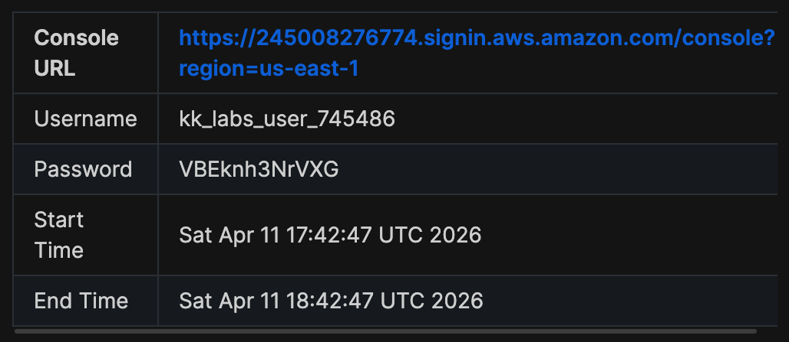

# Day 2: Create Security Groups

## Introduction

The Nautilus DevOps team is strategizing the migration of a portion of their infrastructure to the AWS cloud. Recognizing the scale of this undertaking, they have opted to approach the migration in incremental steps rather than as a single massive transition. To achieve this, they have segmented large tasks into smaller, more manageable units. This granular approach enables the team to execute the migration in gradual phases, ensuring smoother implementation and minimizing disruption to ongoing operations. By breaking down the migration into smaller tasks, the Nautilus DevOps team can systematically progress through each stage, allowing for better control, risk mitigation, and optimization of resources throughout the migration process.

## The Task

For this task, create a security group under default VPC with the following requirements:

- Name of the security group is **xfusion-sg**.

- The description must be **Security group for Nautilus App Servers**

- Add the inbound rule of type **HTTP**, with port range of **80**. Enter the source CIDR range of **0.0.0.0/0**.

- Add another inbound rule of type **SSH**, with port range of **22**. Enter the source CIDR range of **0.0.0.0/0**.

## Credentials

Use below given **AWS Credentials**: 

**Notes**:

Create the resources only in **us-east-1** region.

### Step 1 — LogIn Using Provided Credentials

### Step 2 — Verify location of Region

### Step 3 — Navigate to Security Groups Settings

In order to create a Security Group, you have to navigate to the Security Group link in the EC2 service menu as shown below.

As shown above, there is an existing Security Group, however, per the instructions, we must create another Security Group for the Nutilus DevOps team. 

## Step 4 - Creating the Security Group

Once you navigate to the Key Pair settings as shown above in **Step 3**, the next step would be to click on Create Security Group and enter in the details provided, as shown below: 

 

## Step 5 - Save Changes

Lastly, click on Create Security Group to save changes and successfully create the Security Group as shown below:

