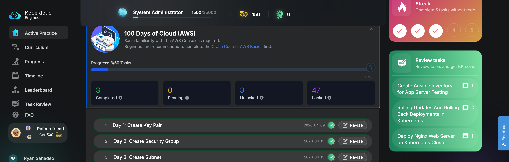

# Day 3: Create Subnet

## Introduction

The Nautilus DevOps team is strategizing the migration of a portion of their infrastructure to the AWS cloud. Recognizing the scale of this undertaking, they have opted to approach the migration in incremental steps rather than as a single massive transition.

## The Task

For this task, create one subnet named **devops-subnet** under default VPC.

## Credentials

Use below given **AWS Credentials**: 

**Notes**:

Create the resources only in **us-east-1** region.

### Step 1 — LogIn Using Provided Credentials

 

### Step 2 — Verify location of Region

### Step 3 — Navigate to Submet Settings

In order to create a Subnet, you have to navigate to the Subnet link in the VPC service menu as shown below.

 

As shown above, there are existing Subnets, however, per the instructions, we must create another Subnet for the Nutilus DevOps team. 

## Step 4 - Creating the Subnet

Once you navigate to the Subnet settings as shown above in **Step 3**, the next step would be to click on Create Subnet and enter in the details provided, as shown below: 

**Note**: The IPV4 CIDR range cannot be an existing IP address listed int he above table so a subnet address of 96 was added to be unique.

## Step 5 - Save Changes

Lastly, click on Create Subnet to save changes and successfully create the Subnet as shown below:

